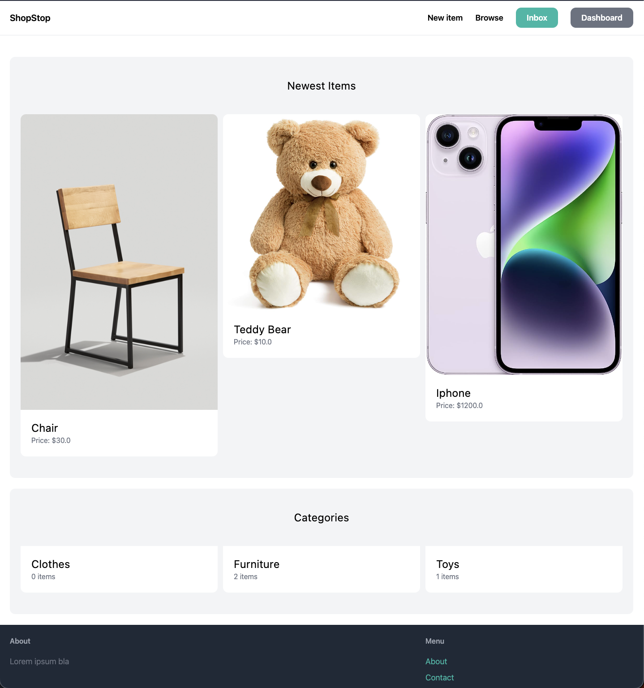
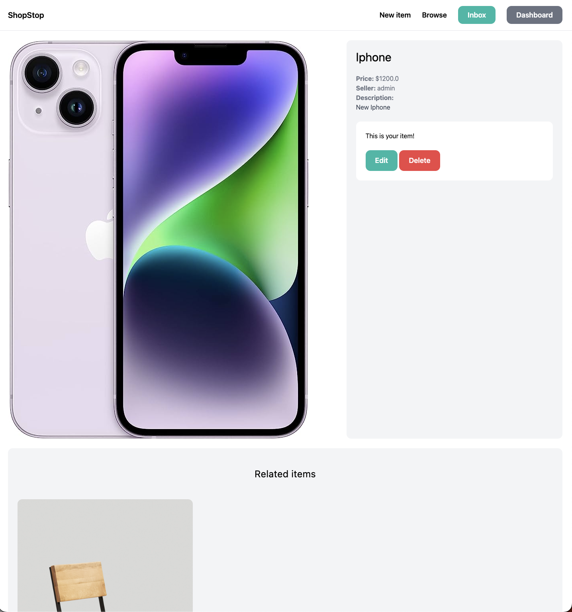

<div align="center">

# **Django App**

## Django Full-Stack Application complete with REST API implementation and page routing

</div>

<br />

## Tech Stack

<code></code>
&nbsp;
<code></code>
&nbsp;

## Additional Technologies

-  SQLite

## Build Setup

```bash
# create new environment
python -m venv env

# run the server
python manage.py runserver
```

## Visuals

<div>




</div>

## Deploys

In Progress

## Contributing

Feel free to dive in! [Open an issue](https://github.com/noahfajarda/snapz/issues/new) or submit PRs.

## Licensing

[](https://opensource.org/licenses/MIT)

## Questions

If you have any questions or concerns, please contact me through my email below:

noahfajarda1@gmail.com

or through my github:

[https://github.com/noahfajarda](https://github.com/noahfajarda)